# Karl's GIR - System Diagrams

**Version:** 3.2.1  
**Last Updated:** December 2025

This document contains visual diagrams of the Karl's GIR system architecture using Mermaid.

---

## Table of Contents

1. [System Architecture Overview](#system-architecture-overview)
2. [User Authentication Flow](#user-authentication-flow)
3. [Round Tracking Flow](#round-tracking-flow)
4. [Build Process](#build-process)
5. [Data Storage Structure](#data-storage-structure)
6. [API Request Flow](#api-request-flow)
7. [Admin Dashboard Architecture](#admin-dashboard-architecture)

---

## System Architecture Overview

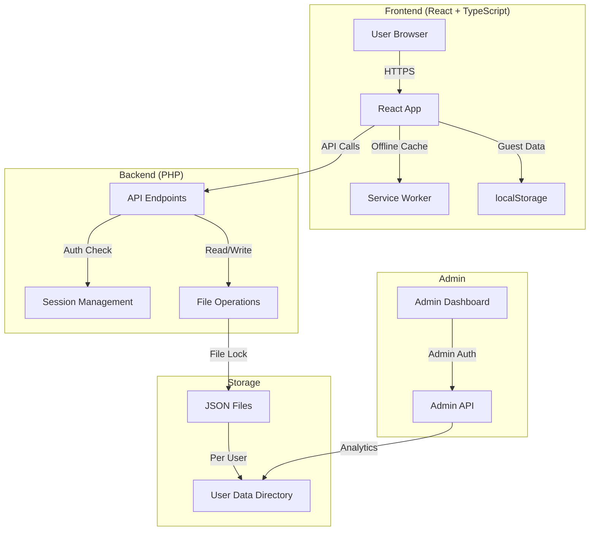

---

## User Authentication Flow

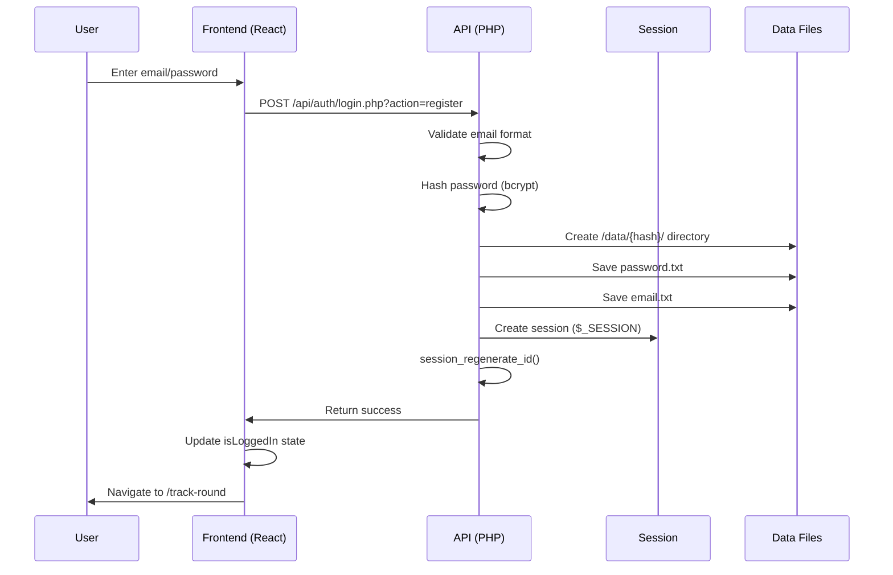

---

## Round Tracking Flow

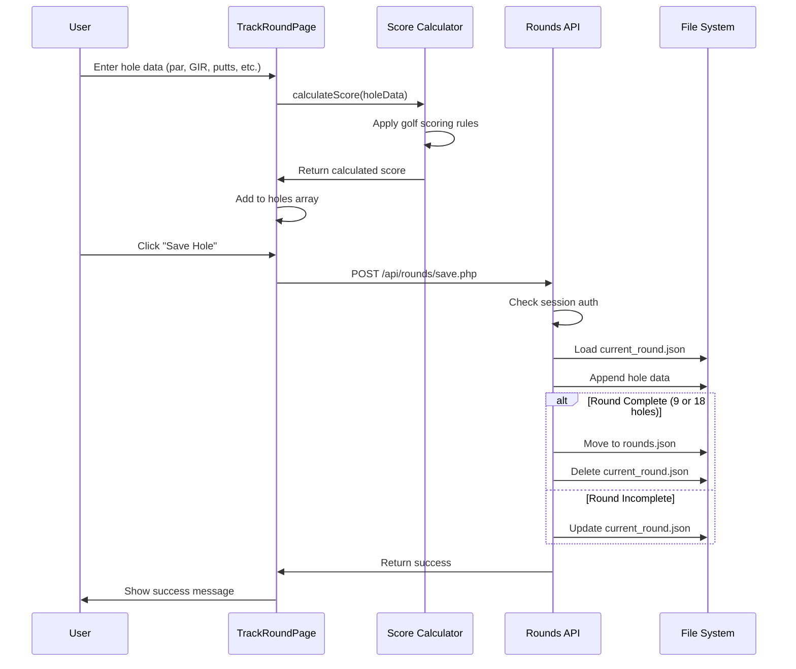

---

## Build Process

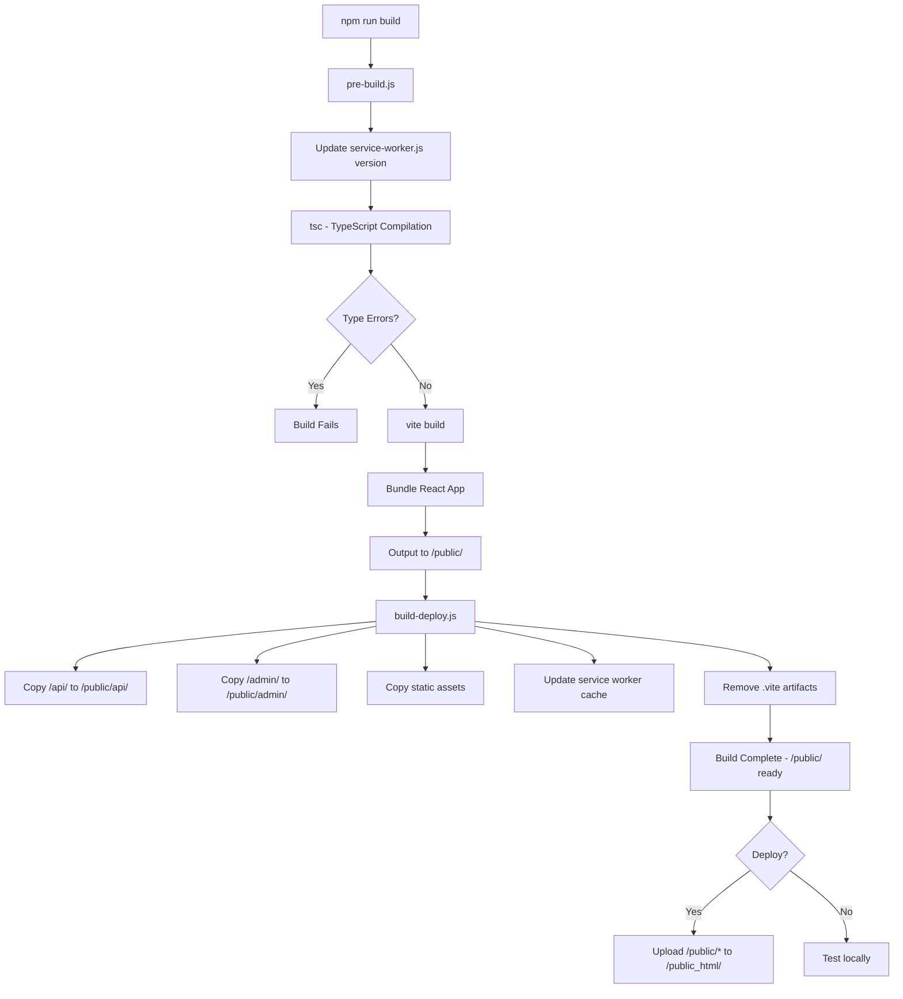

---

## Data Storage Structure

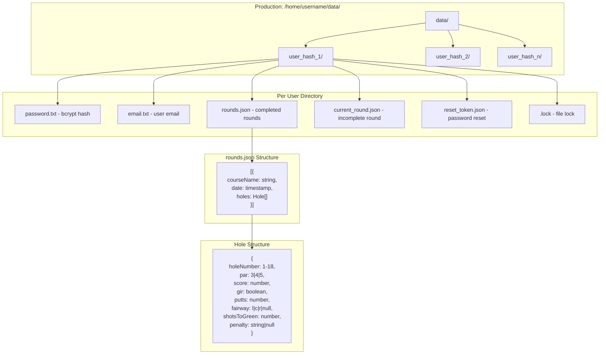

---

## API Request Flow

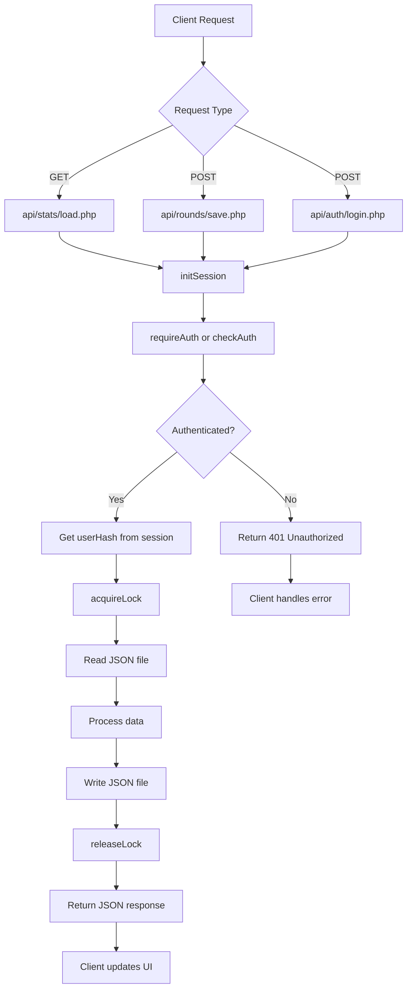

---

## Admin Dashboard Architecture

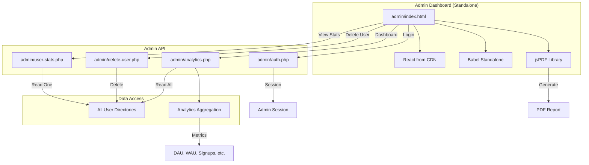

---

## Guest vs Registered User Flow

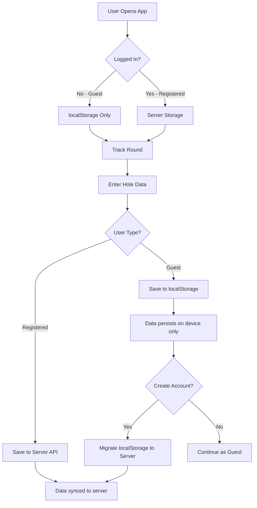

---

## Score Calculation Logic

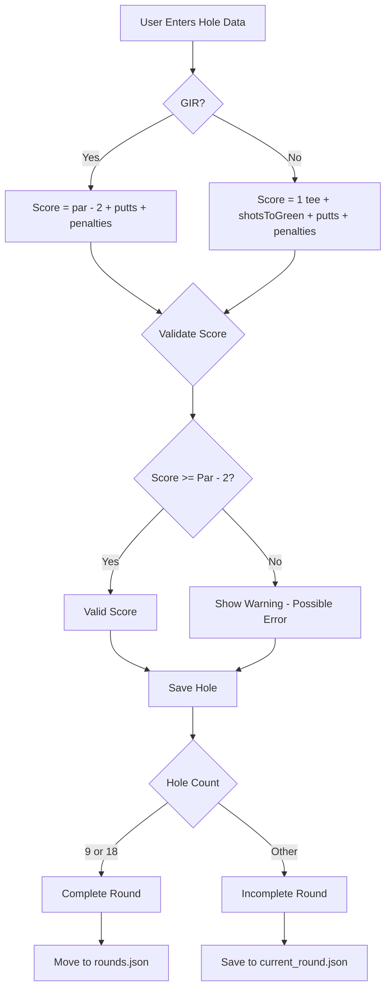

---

## Session Management Flow

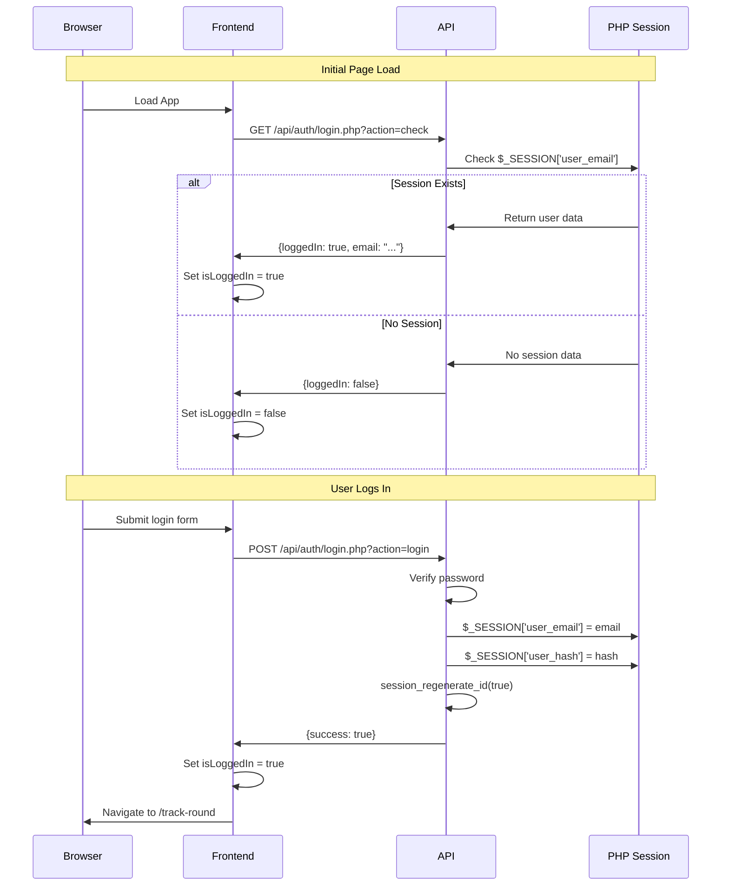

---

## PWA Architecture

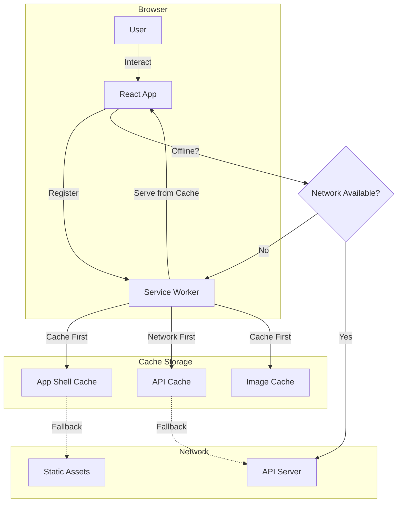

---

## Deployment Architecture

```mermaid
graph TB
    subgraph "Development (Local)"
        A[Vite Dev Server :3000]
        B[Laragon PHP]
        C[Local Data Directory]
    end
    
    subgraph "Build Process"
        D[npm run build]
        E[/public/ folder]
    end
    
    subgraph "Production (SiteGround)"
        F[/public_html/]
        G[Apache + PHP]
        H[/home/username/data/]
    end
    
    A -->|Proxy /api/*| B
    B -->|Read/Write| C
    
    D --> E
    E -->|FTP Upload| F
    
    F --> G
    G -->|Read/Write| H
    
    I[User Browser] -->|HTTPS| F
```

---

**For detailed architecture documentation, see [ARCHITECTURE.md](ARCHITECTURE.md)**  
**For development setup, see [DEVELOPMENT.md](DEVELOPMENT.md)**

