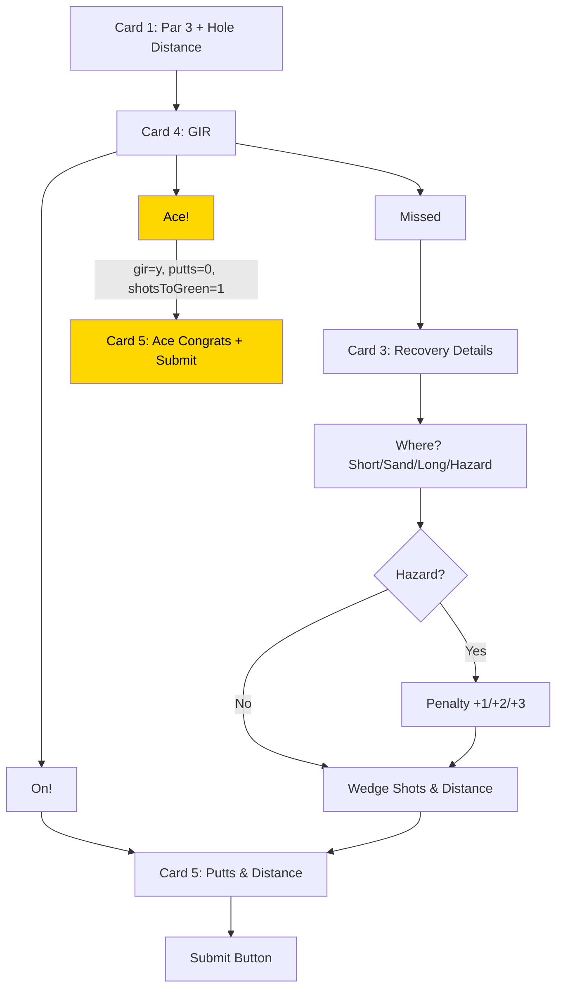
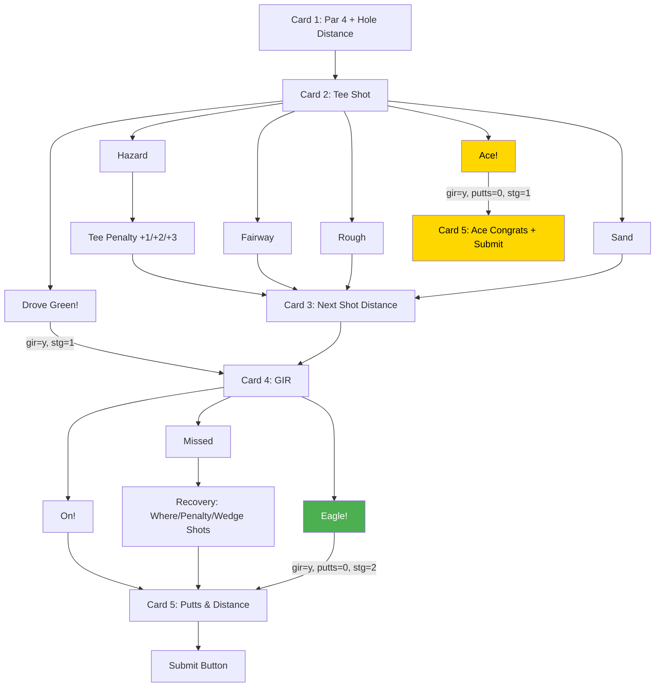
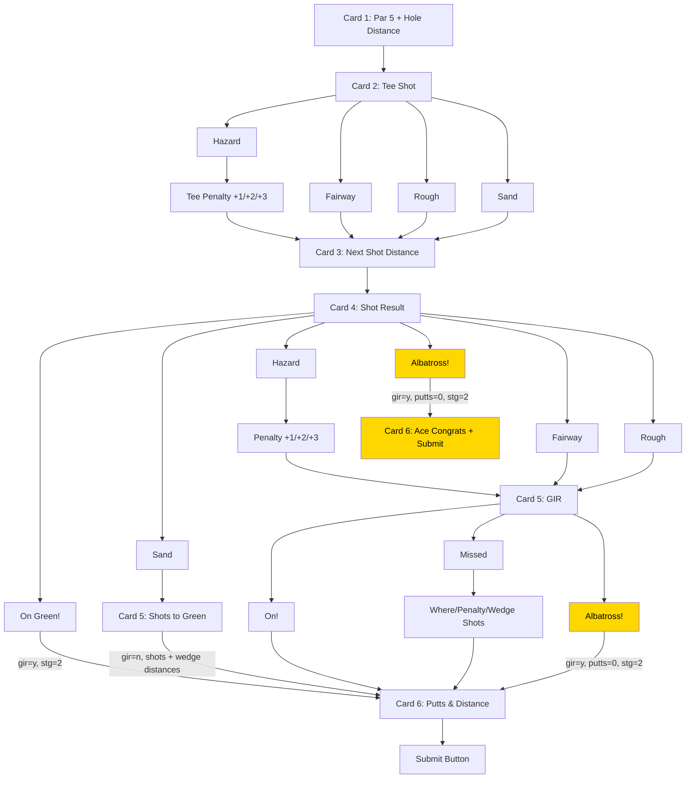

# Scoring Flow Diagrams

Verified against code on March 14, 2026. All flows, score formulas, and state transitions confirmed accurate.

---

## Par 3 Flow

### Par 3 Score Formula
- **GIR = Yes (On!):** shotsToGreen(1) + putts + penalties
  - On! + 2 putts = 1 + 2 = **3 (par)**
  - On! + 1 putt = 1 + 1 = **2 (birdie)**
- **GIR = No (Missed):** base(1) + wedgeShots + putts + penalties
  - Missed + 1 wedge + 2 putts = 1 + 1 + 2 = **4 (bogey)**
- **Ace:** 1 + 0 = **1**

---

## Par 4 Flow

### Par 4 Score Formula
- **GIR = Yes (On!):** shotsToGreen(2) + putts + penalties
  - On! + 2 putts = 2 + 2 = **4 (par)**
  - Drove Green + 1 putt = 1 + 1 + 0 = **2 (eagle)** *(stg=1)*
- **GIR = No (Missed):** base(2, or 1 if tee penalty) + wedgeShots + putts + penalties
  - Sand tee + On! + 1 putt = 2 + 1 = **3 (birdie)**
  - Fairway + Missed + 1 wedge + 2 putts = 2 + 1 + 2 = **5 (bogey)**
- **Eagle:** 2 + 0 = **2**
- **Ace:** 1 + 0 = **1**

### GIR Auto-Denial
- Any tee penalty (+1 or more) → GIR auto-denied

---

## Par 5 Flow

### Par 5 Score Formula
- **GIR = Yes (On!):** shotsToGreen(3) + putts + penalties
  - On! in 3 + 2 putts = 3 + 2 = **5 (par)**
  - On Green! from Card 4 + 2 putts = 2 + 2 = **4 (birdie)** *(stg=2)*
- **GIR = No (Missed):** base(3, or 1 if tee penalty ≥2) + wedgeShots + putts + penalties
- **Albatross:** 2 + 0 = **2**

### GIR Auto-Denial
- Tee penalty ≥ 2 → GIR auto-denied
- 2nd shot in Hazard (secondShotLie='na') → GIR auto-denied

### Card 5 Branching (Par 5 only)
- **2nd shot in Sand/Rough/Hazard:** Shows "shots to get on green" input only (no On!/Missed). Next sets gir='n'.
- **2nd shot in Fairway:** Shows On!/Missed buttons + Albatross! hero button.

---

## Notes
- No Ace button on Par 5 tee shot (not needed — hole-in-one on par 5 is essentially impossible)
- "Drove Green" button only appears on Par 4 tee shot card
- Penalty selector only appears when Hazard is selected
- "Call your coach!" message appears when wedge shots > 3
